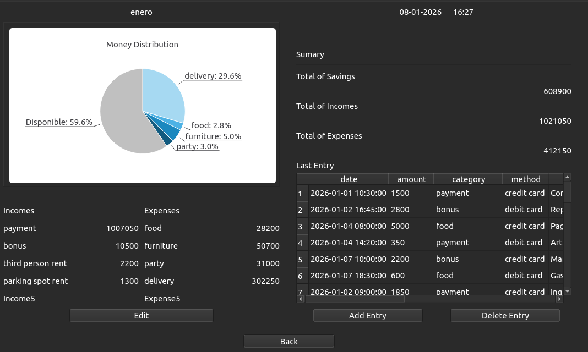

# Budget Monitor

A desktop application for personal finance management built with Qt6 and C++. Track your income and expenses, visualize spending patterns, and monitor your monthly budget with an intuitive interface.

## Features

- **Transaction Management**: Add, view, and track financial transactions
- **Category-based Organization**: Separate income and expense categories
- **Visual Analytics**: Pie chart visualization of expense distribution
- **Monthly View**: Filter and analyze transactions by month
- **Real-time Updates**: Dashboard updates automatically when new transactions are added
- **Multiple Payment Methods**: Support for different payment accounts
- **Database Persistence**: All data stored locally in SQLite database


## Screenshoot


## Technical Stack

- **Qt Framework**: 6.8.3
- **Programming Language**: C++ 17
- **UI Design**: Qt Designer (.ui files)
- **Database**: SQLite 3
- **Build System**: CMake
- **Architecture**: Model-View pattern with QSqlTableModel and QSqlRelationalTableModel

## Project Structure

```
budget_monitor/
├── include/           # Header files
│   ├── dialogs/      # Dialog headers (FormDialog)
│   ├── views/        # Main window headers
│   └── widgets/      # Widget headers (Dashboard)
├── src/              # Source files
│   ├── dialogs/      # Dialog implementations
│   ├── views/        # View implementations
│   └── widgets/      # Widget implementations
├── ui/               # Qt Designer UI files
│   ├── mainwindow.ui
│   ├── dashboardwidget.ui
│   └── formdialog.ui
├── CMakeLists.txt    # Build configuration
└── budget_monitor.db # SQLite database
```

## Database Schema

The application uses three main tables:

- **money_transactions**: Stores all financial transactions
  - `id`, `date`, `amount`, `category` (FK), `account` (FK), `description`
- **categories**: Income and expense categories
  - `id`, `category`, `type` (income/expense)
- **payment_methods**: Available payment accounts
  - `id`, `method`

## Building from Source

### Prerequisites

- Qt 6.8.3 or higher
- CMake 3.10 or higher
- C++17 compatible compiler
- SQLite 3

### Build Steps

```bash
# Clone the repository
git clone --recursive  <repository-url>

# Or, if you already have this repository cloned
git submodule init
git submodule update

# then

cd budget_monitor

# Create build directory
mkdir build && cd build

# Configure with CMake
cmake ..

# Build the project
cmake --build .

# Run the application
./budget_monitor
```

## Usage

1. **Launch Application**: Click "Go" to access the dashboard
2. **View Dashboard**: See monthly summary with income/expense breakdown
3. **Add Transaction**: Click "Add Entry" button
   - Select transaction type (Income/Expense)
   - Choose category and payment method
   - Enter amount and description
   - Click OK to save
4. **View Analytics**: Pie chart shows expense distribution
5. **Navigate**: Use "Back" button to return to main menu

## Roadmap

- [ ] Edit and delete transactions
- [ ] Date range filtering
- [ ] Export to CSV/PDF
- [ ] Budget goals and alerts
- [ ] Multi-currency support
- [ ] Recurring transactions
- [ ] Data backup and restore

## Author
*Natalia B*
